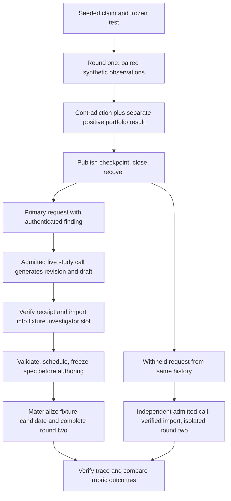

# V5 two-round experimental feedback example

Date: 2026-09-19. Status: scope confirmed; revised design for user review; no example has been implemented or run.

Revision 2 addresses the review of `cc530f6`: live-call/fixture import authority, withheld critic routing, checked case-pattern contrasts, and registry-derived fixed-suite fingerprints. The first-example scope remains model-generated revision with synthetic execution.

Source inspected: `7fcc6af767ddde2756415b2c1f2ede61753ee995`, which includes the three reviewed boundary fixes. Those fixes are local; the last verified remote `main` is `2ed3146`. Execution requires the fixes, wherever the example is eventually run.

## 1. Purpose and recommended scope

Build one inspectable chain: a precommitted claim is contradicted by an experiment despite a higher synthetic portfolio return; a subsequent investigator receives the persisted finding, generates a revised claim and discriminating experiment, and completes a second round. Compare that revision with one generated from the same history with mechanism evidence withheld.

The recommended first example uses a real model for the round-two investigator and a frozen synthetic execution environment. Its claim is **model evidence use in a controlled two-round study**. It does not establish execution of model-authored Python, autonomous strategy improvement, investment returns, or recursive modification of the optimizer itself.

Three approaches were considered:

| Approach | What it establishes | Limitation |
| --- | --- | --- |
| Fully scripted two-round fixture | Repeatable chronology, persistence, request construction and artifact linkage | A prewritten revision does not test model evidence use |
| Model-generated revision with frozen synthetic execution — recommended | Whether a model responds to a measured contradiction and chooses a discriminating next experiment | Candidate decisions and portfolio outcomes remain supplied fixtures |
| Model-authored source executed by a bounded worker | Candidate behavior follows from the generated source, in addition to evidence use | Requires an implemented and independently verified executor; `registered_sandbox` currently returns unavailable |

This revision retains the first-example scope confirmed in the review. Actual source execution is a separate future extension, not an implicit capability of this example or a pending scope choice. No provider call or execution is authorized by this design document.

## 2. What exists and what is missing

Existing reusable components are the mechanism contracts, ATR-fraction corpus builder, paired observation reducer, authenticated sidecars, checkpoint recovery, current/historical role projections, real role request factory and `run_feedback_round_v5`.

The existing continuity test reconstructs an investigator request and then explicitly constructs the next hypothesis. The existing full-runtime test completes one supplied-port round. Combining their assertions does not prove two connected rounds or generated revision.

Missing example components must be implemented explicitly:

1. A bounded driver for two linked real runtime invocations, with a genuine close/reopen boundary.
2. An independently admitted live study call, authenticated import into the fixture runtime, and strict translation of the generated draft to a precommitted mechanism spec before authoring.
3. An honest mapping from the generated proposal to a frozen behavior registry shared by fixed-suite fingerprinting and supplemental observations; no arbitrary generated source may be assigned invented execution results.
4. An isolated evidence-withheld round-two comparison using the same recovered history and explicit request routing for each role.
5. A trace exporter/verifier, checked case-pattern contrasts and a preregistered assessment rubric.

The existing test helper `_LazyFixtureMechanismExtension` permits only evidence-ID reissuance of a seeded hypothesis; it rejects a genuinely revised hypothesis or intent. It cannot be reused unchanged for round two. Add a study-specific capability composer that validates the new draft and builds fresh authority from the actual persisted intent. Do not remove the helper's checks, mutate a frozen capability or rebind the old spec to a new claim.

Production ranking, memory selection, evaluator arithmetic, semantic equivalence rules and existing serializers remain authoritative. The example may configure supported fixture limits, but must not monkeypatch those decisions to obtain a preferred result.

## 3. Round one: a seeded counterexample

Round one is deliberately seeded. Its investigator, author, critic and evaluator responses are labeled scripted fixtures. They establish the counterexample presented to the later model; they are not counted as model reasoning.

Use the existing exit-only vocabulary:

| Field | Round-one requirement |
| --- | --- |
| Target | `evaluate_exit` |
| Recipe | `evaluate_exit_atr20_fraction_v1` |
| Input field | `features.atr_20_fraction` |
| Ordered inputs | `0.20`, `0.50`, `0.80`, missing |
| Applicability | `is_present` |
| Prediction | `exit.decision_changed_count`, increase, zero tolerance, `relevant_cases` |
| Control | `exit.protected_control_unchanged_count`, unchanged, zero tolerance, `control_cases` |
| Minimum relevant cases | 2 |
| Local-only spec | Evaluator diagnostic metric omitted; portfolio evidence remains a separate channel |

For the target candidate A, the frozen synthetic worker returns unchanged decisions on all three relevant cases. The local result is numerator 0, denominator 3, delta 0, `contradicted_on_cases`; the protected next-stop value is unchanged on all four cases. The missing-input case is a negative case, not a discarded control.

A is locally inert on this corpus, not necessarily equivalent on the entire fixed suite. To reach supplemental observation through unchanged V5 admission, its registry behavior must produce a genuine fixed-suite difference on a snapshot outside this corpus, while agreeing with the parent on every corpus snapshot. Freeze that difference and its provenance before the study. If the chosen registry cannot satisfy both properties, the setup fails; do not supply a fabricated distinct fingerprint. A wholly equivalent candidate must remain rejected by the normal equivalence gate and is tested as a separate negative regression.

Use internally consistent synthetic evaluator inputs with the existing evaluator arithmetic to obtain parent return < A return < sibling S return. The existing fixture's large positive synthetic returns can be reused; they must be visibly labeled supplied synthetic values, never market performance. Do not overwrite computed CAGR to manufacture the ordering.

The sibling permits the unchanged selector to retain a stronger incumbent and the real memory budget to summarize A. Assert that A actually enters `memory.summaries`, rather than labeling a hand-built object as a summary. If the configured fixture cannot produce that disposition, fail the setup and adjust the documented fixture before preregistration; do not change selection after seeing a model result.

The scripted critic deliberately omits the mechanism finding from its narrative and citations. Its portfolio statements remain truthful. This tests independent delivery from the authenticated sidecar, not a second copy of the contradiction in critic prose.

Run round one through `run_feedback_round_v5`; publish its records and checkpoint through the existing repository. Label decisions and evaluator outcomes as synthetic; fingerprints are derived from the registry's fixed-suite outputs, not separately supplied distinctness claims. None is an executed measurement of candidate source code.

## 4. Restart and construction of round two

Close the repository and discard process-local objects. Reopen from disk and use the existing recovery reducer, checkpoint, stored records, memory selector and role factory. The round-two parent is the parent actually selected by V5; do not force A or the original baseline to become the parent.

The trace must distinguish the original pair P0→A from the newly selected parent P1→B. A finding about P0→A is historical evidence, not proof about P1→B. If the incumbent is S, every round-two authority and hypothesis must bind to S.

Before the model is invoked, inspect the actual round-two request and require:

- A's claim, prediction, 0/3 finding, contradiction assessment, applicability, controls and synthetic limitations survive summary selection and restart.
- Evidence IDs are regenerated and validated from this request's actual rows and resolve to the authenticated report values. ID strings may recur: the current builder derives them from role, ordinal and metric, and identical reconstruction intentionally produces identical bytes. The trace identifies a citation by request hash plus evidence ID and resolved value; it never imports a prior request's authority merely because a string matches.
- The critic omission remains an omission; no helper injects a replacement explanation.
- Base memory selection and the augmented request's complete admission checks both pass.

Measure the fixture request and actual live-study request separately: canonical request, wire-message and schema byte sizes, projection count, row count, retained/omitted identities, prospective token/cost bounds and reconciled provider usage. Report base and augmented sizes separately: a summary can restore a substantial sidecar, and the study schema adds its own cost. Do not use the legacy fixture schema's size as the live study schema's admission bound, equate serialized bytes with measured tokens, or increase limits just to fit the example.

## 5. Generated revision and precommitment

The real investigator must generate the revision; the harness may not substitute a known answer, repair its reasoning, insert a citation, select its experiment after the result, or silently retry until it produces the desired hypothesis.

The prompt supplies the task, allowed mechanism vocabulary and evidence. It does not supply the expected revision, the scoring answer, or fixture outcomes. Assess explicit claims and proposed tests in the returned artifact, not private chain-of-thought.

The investigator's output needs both an existing `HypothesisV5` and an example-specific structured experiment draft. The existing hypothesis alone does not declare the mechanism predicate, recipe and resource-bound spec. A new opt-in typed response/draft adapter is therefore a prerequisite; the current code must not be described as already providing this interface. Preserve the unwrapped legacy schema and bytes.

Use a versioned study response envelope containing the ordinary investigator artifact and its associated experiment drafts, with a separately pinned opt-in schema and parser. The default investigator schema rejects extra fields, so adding a field to the legacy response is not an implementation shortcut. The adapter covers both schema translation and the live-call/fixture authority boundary described below. Only the ordinary validated investigator artifact enters the existing scheduler. This bridge and its provenance tests are new implementation work.

### 5.1 Live study authority and authenticated fixture import

Keep both runtime arms provider-free under the existing fixture manifest contract (`provider=None`, `pit_data_scope="production"` as used by `compose_fixture_round_v5`; this scope label does not authorize market access). Every runtime role completion has `FixtureRoleTerminalAuthorityV5`. Do not enable a provider on that manifest: `_Runtime._valid_terminal_authority` then requires ledger-backed completions for every role, including the scripted author and critic. Do not switch to the separate development/controller authority path, weaken that check, or wrap a live receipt in a fixture label and discard its accounting.

The real model call belongs to a separate, explicitly admitted study-call authority with a study/arm/attempt ID, grant, pinned model/settings, schema hashes, prospective limits and ledger. A new study adapter may reuse applicable one-shot provider and ledger primitives, but must support its own versioned request/response schema; the existing V5 role runner does not automatically admit this envelope. The live request is not mislabeled as an already supported legacy `RoleRequestV5` if its schema differs.

Use this sequence for each round-two arm:

1. Freeze its recovered fixture root/checkpoint. With the real selector and that arm's request factory, construct the expected investigator fixture request F and exact intended runtime call key. Persist an immutable study copy of F, its canonical bytes, role binding, schema, evidence map and root/checkpoint identity. This preflight does not fabricate a runtime role-completion event.
2. Build live study request L deterministically from F plus the pinned study instructions and response schema. Preserve F's evidence, claim context, parent and expected binding. Persist the actual live messages and schema bytes, both request identities, and the complete allowed translation diff; F and L are not assumed to have equal hashes.
3. Reserve and authorize L under the live study ledger and limits, then make at most one external attempt. Preserve the raw provider response, parsed study envelope, attempt facts, usage/cost and authenticated terminal receipt. Only a successful, validated, reconciled terminal result can be imported. A receipt-shaped JSON file or a matching digest alone is insufficient authority.
4. Validate the envelope against L and F. Extract the ordinary investigator artifact without changing its claims, ranks, parameters or citations. Encode a legacy response T with F's exact binding and that artifact; validate T using the existing parser against F. The deterministic projection may remove the study-only draft wrapper, but may not repair or rewrite the generated hypothesis.
5. Create a typed, immutable study import record binding the study/arm/attempt, grant/ledger terminal authority, F and its runtime call key, L and actual schema/wire hashes, original response hash, parser/translator version, parsed envelope, T, investigator artifact and draft hashes. Verify the ledger authority and all referenced bytes before replay; reject cross-arm, stale-checkpoint, changed-request, missing-receipt or conflicting imports.
6. Invoke `run_feedback_round_v5`. It reconstructs and persists its actual investigator request. A new fixture import invoker must require exact equality with F and the intended call key before replaying T through fixture parsing and returning a fixture completion. It makes no provider call. If runtime reconstruction differs, abort this arm with the paid study attempt preserved; do not translate again or call the model again to make it fit.
7. After the runtime selects the hypothesis and saves its round intent, append a separate create-only draft-binding record linking that intent to the import record and exact selected hypothesis/draft. The `before_authoring` composer verifies this chain and creates the fresh spec/capability. Do not mutate the prior import record to add an eventual intent or accept an unrelated in-memory draft.

Import authentication must validate the full live authority chain, not only the terminal receipt's self-consistent digest: exact study repository/manifest/ledger/audit identities; live call key with role position, attempt kind/index and request hash; reserved slot and authorization hash; actual request/schema hashes; raw response hash; attempt-facts hash; terminal receipt hash/sequence and cumulative usage; parsed and translated artifact hashes. Bind the separate fixture `RoleCallKeyV5` explicitly. The checks in `_authenticate_role_invocations_v5` are a reference for these obligations, not a claim that its production all-role verifier already accepts a new study envelope.

The live ledger owns actual external calls, tokens and cost. Fixture replay retains honest zero-external-attempt fixture facts; those facts do not mean the study was free. The exporter reports both domains and counts each authenticated live attempt once, never adding the imported copy as a second billable call. Synthetic campaign budgets and live-study budgets are distinct and neither can substitute for the other's authorization.

Both arms consume one shared live-study budget/ledger outside the cloned fixture roots; cloning a checkpoint must not clone or reset live spending authority. Arm-specific slots bind the corresponding F/L pair while cumulative limits cover the entire paired study. Unresolved live accounting blocks further study admission until reconciliation establishes the terminal outcome; fixture replay cannot erase an outstanding reservation.

Recovery is read-only with respect to model invocation: the import invoker's `reconcile_once` loads and verifies the same immutable import/T/package rather than using `FixtureRoleInvokerV5`'s default canned response or making another live call. Existing runtime packages must also be checked against the import provenance by the study verifier. Unknown or pending live usage, a nonterminal receipt, or an interrupted translation/import leaves the arm incomplete until explicit reconciliation establishes the exact terminal result. Completed imports may be resumed idempotently; conflicting artifacts fail closed. No automatic retry or fresh slot is used to conceal an interruption.

Implement an explicit study/import verifier for those packages. The existing `verify_fixture_run_v5` also requires each response hash to equal the canned `_response(package.request)` output; arbitrary live-derived T does not satisfy that expectation merely by having valid fixture terminal authority. Leave that verifier unchanged. The study verifier must instead reconcile investigator responses to authenticated T/import records and scripted roles to their preregistered response expectations, while retaining all applicable request, artifact, journal, usage and checkpoint consistency checks. Never suppress the stock verifier's mismatch or call it proof of a live-derived import.

### 5.2 Draft compilation and checked contrast

The draft contains the hypothesis reference, cited request-local evidence IDs, applicability predicate, ordered ATR values, registered metrics/directions/tolerances/denominators, an explicit expected case pattern and competing patterns, disconfirming result and selected synthetic candidate family/parameters. It carries no paths, executable code, arbitrary metric definitions, hashes asserted as authority, or permission to execute.

The controller validates the draft against the closed registry, checks its references against the returned hypothesis and request evidence, and derives all authoritative identity fields from the actual scheduled hypothesis, selected parent and persisted round intent. A deterministic compiler creates `MechanismExperimentSpecV1`. No free-text inference is used to turn a hypothesis into a supposedly precommitted test.

For this example, compilation requires at least two applicable cases, at least one non-applicable case, unique inputs and converted snapshots, and the fixed all-case next-stop control with zero tolerance. Reject a proposed recipe that cannot exercise its declared condition. The model cannot weaken the controls, case minimum or resource limits. Preserve the raw paired decisions for negative cases too: an unchanged next-stop value does not, by itself, prove that the entire exit decision was unchanged.

Compile a separate versioned study contrast contract before authoring, bound to the same draft, parent, corpus and precommitment. For every ordered input—including negative and missing-input cases—it declares whether the canonical candidate `ExitDecision` is expected to differ from the parent's, together with the rival patterns the test purports to distinguish. Use this closed boolean observable for the first example; reject claims requiring an unsupported observable instead of interpreting prose. At least one registered case must separate each declared rival from the claimed pattern. For a threshold-specific claim, both inert and always-on change are required rivals. Human assessment additionally checks that the stated claim agrees with this typed contract.

For a claim of change exactly at and above 0.50, the preregistered pattern is:

| ATR input | Threshold-specific change | Inert rival | Always-on rival |
| --- | --- | --- | --- |
| 0.49 | unchanged | unchanged | changed |
| 0.50 | changed | unchanged | changed |
| 0.51 | changed | unchanged | changed |
| missing | unchanged | unchanged | changed |

After observation, the study verifier derives the actual pattern from the authenticated raw parent/candidate decision bytes for every case and checks all cells, not only relevant cases. Threshold and always-on behavior can both produce a supported 2/2 production decision-change result with unchanged next-stop controls; only the threshold pattern passes this study contrast. Emit a separate `matched_on_cases`, `contradicted_on_cases` or `unavailable` contrast verdict with the mismatched input identities. A failed/incomplete observation makes the contrast unavailable, not supported. Preserve the production metric report unchanged, even when it supports the aggregate prediction while the study-level specificity claim is contradicted.

Required event order:

1. Persist F, the admitted live request L, its raw response/receipt, and the validated import/T/draft chain; import it only into the matching actual fixture investigator slot.
2. Validate the imported artifact and select the hypothesis through the existing scheduling rules.
3. Persist the round intent and its draft-binding record; compile and persist both the mechanism spec and study contrast before authoring.
4. Only then issue the author request and materialize B.
5. Bind B's actual source identity to the previously frozen spec; then collect observations and evaluate.

A timestamp or `frozen_before_authoring=True` alone is insufficient. The verifier must check journal ordering and hash references. Binding candidate identity after materialization must not permit changing the recipe, applicability or prediction.

One illustrative revision is to reject the claim that A's higher return validates its exit explanation and propose an explicit ATR threshold test. For a proposed threshold 0.50, inputs 0.49, 0.50, 0.51 and missing distinguish the declared patterns only when the study checks every case; the relevant-case aggregate alone does not establish threshold specificity. This is an explanation for the reader, **not an answer injected into the model prompt or the sole accepted revision**. Other valid registered discriminating proposals must supply equally explicit, checkable patterns and are evaluated by the same rubric.

## 6. Honest synthetic execution

Freeze a finite catalog of allowed synthetic candidate families/parameter assignments, their materialized source identities, decision functions, evaluator inputs, fixed-suite outputs and registry hash before the first model invocation. The registry is not modified in response to the model's prediction. Include an inert option and behaviorally different options so choosing an equivalent candidate or an always-on alternative is observable. The model may choose only a registered assignment; unregistered configurations are rejected rather than assigned new outcomes after the call.

The recommended example uses a deterministic author/materializer for this closed candidate domain. Model output chooses a permitted candidate family and parameters; the author materializes the corresponding reviewed template. The trace labels this as template selection, not unrestricted model-authored code.

The fixture worker's decision function is fixed independently of the model's predicted direction or claimed result. It consumes only the registered fixture identity/parameters and case inputs. Never define the worker as “return whatever makes the model's prediction pass.” Reject unsupported proposals rather than assigning them a plausible fixture result.

### Fixed-suite and supplemental consistency

For each parent/candidate identity, derive canonical outputs for every method/snapshot in `policy_probe_suite_v1()` from the same registry decision functions used for supplemental cases. Freeze those outputs, the exact suite/input identities and resulting `SemanticFingerprintV5` at preregistration. Use the existing canonical observation/fingerprint construction and comparison rules, including repeated/interleaved determinism validation; do not assign an unrelated fingerprint, flip a `distinct` flag or alter output solely because a call is for fingerprinting. Non-exit methods retain the registered parent behavior.

The registry function is keyed by registered policy identity, method and canonical snapshot, not study phase, model prediction, probe label or desired admission result. Verify every frozen fixed-suite output against that function. For any method/snapshot shared by the fixed suite and supplemental corpus, require identical canonical decision bytes for the same policy identity. Check overlap by full typed snapshot identity, not by ATR value alone. Recompute and verify fingerprints on reopen against the frozen registry and suite.

The standard semantic classifier decides admission. Truly equivalent parent/candidate outputs must produce `behavioral_equivalent`; equivalent siblings retain their normal sibling rejection. The runtime may then omit supplemental evaluation, and the trace must report that disposition rather than force a report. For the seeded A and any second-round proposal intended to reach observation, preflight must establish honest fixed-suite divergence from consistent registry behavior. The example's earlier `_static_fingerprint(distinct=True)`/variant-only helpers do not satisfy this registry requirement and must not be reused to manufacture admission.

The 0.50 table above illustrates contrast verification, not a guarantee of semantic admission. The current fixed exit snapshots use ATR fractions 0.025 and 0.075; a pure change active only at or above 0.50 can be equivalent on that suite and must then be rejected. The frozen catalog must contain at least one genuinely admissible discriminating option for the actual parent—for example a 0.05 boundary with supplemental values 0.049, 0.050, 0.051 and missing, if its registry outputs differ on the fixed suite. Verify that relation during preregistration. Do not add an unrelated behavior change after a generated proposal merely to get past equivalence, and do not extend the fixed suite inside this study. If the model selects an equivalent option, report the rejection and an incomplete second experiment rather than replacing it with the admissible option.

Complete the actual second runtime round, including fixed checks, observations, synthetic evaluator results, critic packet, publication and checkpoint. Reopen the repository again and verify B's record and report. A revised hypothesis alone, an author request alone, or a report assembled outside the runtime is insufficient.

Round two may support or contradict the new prediction. A truthful failure or further contradiction is a valid experimental outcome; it must not be rewritten into success. A model-use verdict and an experiment-outcome verdict are separate.

## 7. Evidence-withheld comparison

After publishing round one, make two isolated descendants of the same immutable checkpoint and repository snapshot. Record their common ancestor hashes. The comparison is an alternative round two, not a third optimization step and not a new saved campaign.

Primary arm: use the normal mechanism adapter and full reconstructed evidence.

Withheld arm: use the existing factory without the optional mechanism adapter for investigator and author request construction. Keep the mechanism extension active so the second experiment still produces its own evidence. A new study request router must delegate the current-round critic to the mechanism-enabled factory: the runtime detects `critic_request_with_mechanism`, and that method rejects a factory whose adapter is absent.

| Arm/role | Request route |
| --- | --- |
| Primary investigator and author | Mechanism-enabled factory; author still receives `AuthorRoleInputV5` |
| Withheld investigator and author | Base factory with no mechanism adapter; only that arm's issued base evidence is citable |
| Both arms' current-round critic | Mechanism-enabled factory's `critic_request_with_mechanism`, with that arm's current candidate/report bundles |
| Critic without a mechanism bundle, if the runtime legitimately takes that path | Normal critic construction with its usual validation; never a fallback after augmented construction fails |

Both factories in an arm share the exact repository, authenticated fixture manifest and unchanged admission limits. The router does not reconstruct requests, suppress extension dispatch, bypass the final guard or retry a failed enabled critic through the base route. The withheld critic may see its own round-two results after the investigator/author decision; that is not disclosure of round-one supplemental evidence to the withheld investigator. It does not get the primary arm's findings.

Inject the router itself as `FeedbackRoundDependenciesV5.requests`; configuring an unused helper is insufficient because the runtime discovers the augmented critic method on that object. Route the exact bundles obtained from this arm's active `role_request_evidence`, preserving the adapter's manifest, intent, candidate and report validation and its request-local evidence issuance.

Preserve the same base history, selected parent, supplied portfolio results, task wording, model revision/settings, live-study budget ceiling, response schema and frozen candidate domain. Do not delete or alter source sidecars and do not forge omission reasons such as corruption or budget eviction.

Both arms retain the existing `AuthorRoleInputV5`; the author is not given a mechanism wrapper. Its cited evidence is rebuilt through that arm's own investigator factory. The withheld model must cite only evidence issued in its base request. Replaying the primary hypothesis with mechanism citations into the withheld author path would be invalid; retain that rejection rather than inventing replacement citations.

Before either call, export both exact requests and a normalized comparison. Assert that the base inputs agree and list every remaining difference: mechanism wrapper/projections, issued rows and any resulting request-local IDs, serialization size and admission accounting. This is an evidence-availability ablation; it is not byte-identical or token-length matched. The wrapper and length differences are acknowledged confounds.

Check the withheld request for leakage through critic prose, summaries, labels, study prompts or expected-answer text. Facts independently inferable from candidate source or ordinary results are not falsified or hidden by editing production history. If the contradiction is otherwise explicitly present, the arm is not a valid withholding intervention and the comparison is inconclusive.

Use the same pinned model and settings in independent contexts; record whether a seed is supported. One paired example cannot establish statistical causality or model reliability. The withheld arm is allowed to reason well. Equal revisions, invalid outputs or no discernible contrast are reported as inconclusive evidence of feedback attribution, not retried away.

Each arm's valid generated proposal can complete its own isolated second round. An invalid proposal terminates that arm with its raw response and reason retained; never run an unvalidated candidate to preserve symmetry. Neither arm can observe the other's response or outcomes.

## 8. Preregistered acceptance rubric

Freeze the rubric and study manifest before model calls. Record each gate independently; do not combine them into an opaque success score.

| Gate | Required evidence |
| --- | --- |
| Trace integrity | Two completed linked runtime rounds in the primary arm; exact parent/spec/candidate/report/checkpoint relationships; successful recovery; valid withheld proposals also complete and reopen through the explicit critic route |
| Live import authority | F→admitted L→raw response/terminal ledger receipt→validated T/import→fixture completion→draft/intent binding reconciles; fixture and live usage remain distinct and no replay adds a provider attempt |
| Evidence delivery | Actual round-two request contains the authenticated contradiction despite summary selection, restart and critic omission |
| Evidence interpretation | Generated revision accurately distinguishes 0/3 local contradiction from positive synthetic portfolio return and retains finite-case/synthetic limitations |
| Revision quality | Generated proposal changes the explanatory claim or test in a way justified by the finding; repeating the original claim with a fresh citation does not pass |
| Discrimination | Frozen expected and rival patterns differ on declared cases; the verifier checks raw decisions for every relevant/negative/missing case and emits a separate contrast verdict |
| Synthetic consistency | Fixed-suite fingerprints derive from frozen registry outputs; shared snapshots agree with supplemental observations; genuine equivalence/sibling rejections remain intact |
| Controls | `control_cases`, zero tolerance, next-stop invariant checked on every supplied case including missing input |
| Precommitment | The generated draft and compiled spec exist before authoring; no result-dependent changes |
| Outcome honesty | Every measured/unavailable/failed state agrees with stored observations; missing evaluator attribution is not fabricated |
| Accounting | Both actual request forms pass unchanged guards; all bytes, bounds, usage and provider failures are recorded |
| Feedback attribution | Paired revisions and rubric results are compared with all confounds disclosed; no requirement that the withheld arm fail |

Automate identity, chronology, import/ledger reconciliation, fixed-suite consistency, per-case contrast, measurement, control, citation and accounting checks. A human reviews the explicit generated claims and proposed contrasts using the frozen rubric; any automated semantic grader is advisory and its prompt/output must be retained. A model grading itself is not sufficient acceptance evidence.

The final reader sees separate verdicts: trace verified; evidence delivered; evidence used; discriminating experiment completed; attribution supported/inconclusive; code execution not established; optimization gain not established. Do not publish “fully working self-recursive optimizer” based on this study.

## 9. Trace artifact and reader view

Export one self-contained local bundle with these proposed artifacts. Paths are study outputs, not new production repository authorities.

| Artifact | Contents |
| --- | --- |
| `study-manifest.json` | Source revision, schema/fixture/registry/rubric hashes, model settings, configured limits, scope and provenance |
| `artifact-index.json` | Every exported artifact's content hash, type and explicit references to upstream identities |
| `live-study-calls/` | Per-arm admitted live request/messages/schema, ledger authorization and terminal receipt, raw response, usage/cost and recovery state |
| `imports/` | F/L/T identities, versioned translation records, parsed artifact/draft links, runtime call-key bindings and separate saved-intent bindings |
| `behavior-registry/` | Frozen policy/configuration/source identities, decision functions, fixed-suite inputs/outputs, derived fingerprints, overlap and equivalence checks |
| `round-1/` | Exact role requests/responses, frozen spec, candidate identities, paired observations, evaluator inputs/results, critic, journal and checkpoint |
| `round-2-primary/` | Recovered request, generated response/draft, compiled spec, author materialization, complete second-round evidence and checkpoint |
| `round-2-withheld/` | Corresponding isolated arm artifacts or terminal rejection/failure record |
| `request-comparison.json` | Allowed and actual request differences, leakage audit, size and accounting comparison |
| `case-contrasts/` | Precommitted expected/rival patterns, per-case observed pattern, mismatches and study-level contrast verdicts, linked to unchanged production reports |
| `rubric-results.json` | Gate-level measurements and human assessment with artifact references |
| `trace.md` | Readable claim → precommitment → observations → finding → generated revision → second experiment, with links to exact files |

Export the existing canonical artifact bytes without silently re-encoding or redacting content and continuing to use the original hash. If a shareable derivative is needed, label it as a derivative with its own hash and retain the original local artifact. Hash linkage proves content identity; it is not an operator signature or execution authorization.

The reader view presents both round-two decisions side by side, displays the actual generated revision rather than a curated paraphrase, and labels every scripted, live-generated, imported/replayed, measured, synthetic or unavailable value. Show production aggregate and study contrast verdicts separately, and show actual study spend alongside zero-cost fixture replay. Do not export credentials or read credential files to build the bundle.

## 10. Failure handling and execution gates

The three fixes at `7fcc6af` are prerequisites. Their regression coverage must remain green before implementing the driver: local-only finalization with evaluator contexts; final worker/cleanup deadline overruns; and unavailable-worker limitation delivery.

Offline implementation verification uses fresh temporary synthetic repositories and no provider or market calls. Live evidence-use execution requires a separate explicit grant for the selected model, provider, call/token/cost limits and persistence of responses. The design does not invent such a grant or reuse a saved campaign authorization.

For the recommended first study, there are at most two admitted live-study investigator attempts: one primary and one withheld, outside the fixture runtime. Their validated outputs are imported; all other role responses are deterministic fixtures. Disable automatic provider retries at the study boundary; record any provider-internal retry policy before running. A transport, validation, import, admission or budget failure terminates the affected arm as incomplete. Reconcile and retain usage even if parsing/import fails. A later rerun is a separately identified and authorized attempt, never silently substituted into the original trace.

Before live execution, focused offline regressions must cover these four review requirements:

1. Reject mixed terminal-authority types under unchanged runtime manifest checks. Demonstrate a mocked, ledger-authenticated study completion importing only into its exact fixture call/request/arm; retain original and translated response hashes and actual usage. Reject tampered/missing/failed/pending receipts, mismatched ledger/audit/authorization identity or receipt sequence, schema/request mismatch and cross-arm imports. Reopen/reconcile without another external attempt or fallback canned response. Verify live-derived T with the study verifier, and retain the stock fixture verifier's rejection of non-canned responses.
2. Complete a valid withheld second round through base investigator/author requests and the enabled current critic, then reopen and recover its checkpoint and local reports. Assert that investigator input lacks the historical mechanism rows while the critic receives only the correct current bundles and passes one final admission guard.
3. Feed threshold, inert and always-on decision patterns through the same frozen contrast. Threshold and always-on may share a supported 2/2 production result, but always-on must fail the negative/missing-case pattern checks. Verify unavailable handling and rejection of post-author pattern changes.
4. Recompute registry fingerprints from canonical fixed-suite outputs, reject any fixed/supplemental overlap mismatch or tampered vector, and preserve true parent/sibling equivalence rejections without supplemental worker calls. Confirm the seeded A's legitimate distinct fixed case lies outside its unchanged supplemental corpus.

These are planned regression requirements, not claims that additional tests have been implemented or passed during design revision.

Deadline enforcement in the synthetic worker is cooperative. `registered_sandbox` remains unavailable. No real CPU/peak-memory enforcement, market dataset, backtest, candidate-source execution, held-out evaluation, saved campaign resumption, trade or deployment is part of this example.

## 11. Real authored-code execution option

If the user selects actual code execution, retain the trace, paired comparison and rubric, but replace the synthetic candidate domain with a separately designed bounded executor. Before the study can run, it must execute the exact bound parent and candidate source on the same frozen snapshots, isolate sessions, enforce deadlines/resources outside the candidate process, prevent undeclared I/O and retain authenticated observations and cleanup outcomes. Fingerprints and fixed checks must also come from the actual candidate path rather than fixture claims.

Do not relabel the current fixture registration as a sandbox or treat a source hash as proof of execution. Author generation and executor verification increase the scope and provider-call budget; that implementation plan and its execution grant require separate review. The first design does not claim those prerequisites are complete.

## 12. Design completion versus experiment completion

This document is the design deliverable. A subsequent implementation plan must name the driver, admitted live-study/schema/import boundary, structured draft compiler, per-role request router, consistent behavior/fingerprint registry, case-pattern verifier, comparison and trace exporter, plus focused tests for each acceptance gate. No such component is considered implemented merely because it is specified here.

The next review is of this revised design before implementation planning; the example's scope is already agreed. Implementation and live-model execution are separate steps. Until execution artifacts satisfy the gates above, the demonstrated status remains the existing mechanism feedback infrastructure and its focused offline tests.

## Source references

- [Registered predicates, recipes and mechanism specifications](../../../core/pit_optimizer_v5/mechanism_contracts.py)
- [Corpus construction and bounded synthetic observations](../../../core/pit_optimizer_v5/mechanism_probes.py)
- [Authenticated capability, precommitment and persistence](../../../core/pit_optimizer_v5/mechanism_artifacts.py)
- [Investigator/author factories and optional mechanism adapter](../../../core/pit_optimizer_v5/production_runtime.py)
- [Round runtime and before-authoring extension hook](../../../core/pit_optimizer_v5/runtime.py)
- [Role authority types, parsing and ledger receipts](../../../core/pit_optimizer_v5/provider.py)
- [Production role/ledger authentication checks](../../../core/pit_optimizer_v5/production_provider.py)
- [Provider-free fixture composition and replay](../../../core/pit_optimizer_v5/fixture_runtime.py)
- [Fixed-suite observations, fingerprint construction and classification](../../../core/pit_optimizer_v5/probes.py)
- [Existing continuity and single-round fixtures](../../../tests/test_pit_optimizer_v5_mechanism_artifacts.py)

Design verification: the first read-only Luna/max source audit checked the runtime's persisted-intent/before-authoring sequence, strict investigator schema, external spec requirement, seeded helper restriction, supported ATR predicates/recipes, control denominator, request-scoped citation behavior, author input reconstruction and optional-adapter ablation. The draft was corrected to permit identical reissued ID strings and to preserve per-arm author citation authority. Revision 2 additionally checks the global terminal-authority discriminator, absent-adapter critic rejection, fixed-suite fingerprint construction and insufficiency of relevant-case aggregates for threshold specificity. A second bounded Luna/max audit confirmed the revised import/routing boundaries and identified the full ledger-chain authentication and separate study-verifier requirements now recorded above. These are design/source consistency checks, not execution evidence; no example code, tests, provider calls or candidate execution were performed.
