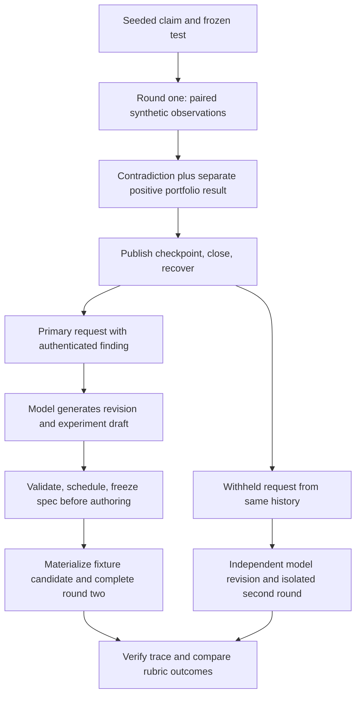

# V5 two-round experimental feedback example

Date: 2026-09-19. Status: design for user review; no example has been implemented or run.

Source inspected: `7fcc6af767ddde2756415b2c1f2ede61753ee995`, which includes the three reviewed boundary fixes. Those fixes are local; the last verified remote `main` is `2ed3146`. Execution requires the fixes, wherever the example is eventually run.

## 1. Purpose and recommended scope

Build one inspectable chain: a precommitted claim is contradicted by an experiment despite a higher synthetic portfolio return; a subsequent investigator receives the persisted finding, generates a revised claim and discriminating experiment, and completes a second round. Compare that revision with one generated from the same history with mechanism evidence withheld.

The recommended first example uses a real model for the round-two investigator and a frozen synthetic execution environment. Its claim is **model evidence use in a controlled two-round study**. It does not establish execution of model-authored Python, autonomous strategy improvement, investment returns, or recursive modification of the optimizer itself.

Three approaches were considered:

| Approach | What it establishes | Limitation |
| --- | --- | --- |
| Fully scripted two-round fixture | Repeatable chronology, persistence, request construction and artifact linkage | A prewritten revision does not test model evidence use |
| Model-generated revision with frozen synthetic execution — recommended | Whether a model responds to a measured contradiction and chooses a discriminating next experiment | Candidate decisions and portfolio outcomes remain supplied fixtures |
| Model-authored source executed by a bounded worker | Candidate behavior follows from the generated source, in addition to evidence use | Requires an implemented and independently verified executor; `registered_sandbox` currently returns unavailable |

This draft assumes the recommended scope for the first example. Actual source execution is a separate design option for user review, not an implicit capability of the recommended example. No provider call or execution is authorized by this design document.

## 2. What exists and what is missing

Existing reusable components are the mechanism contracts, ATR-fraction corpus builder, paired observation reducer, authenticated sidecars, checkpoint recovery, current/historical role projections, real role request factory and `run_feedback_round_v5`.

The existing continuity test reconstructs an investigator request and then explicitly constructs the next hypothesis. The existing full-runtime test completes one supplied-port round. Combining their assertions does not prove two connected rounds or generated revision.

Missing example components must be implemented explicitly:

1. A bounded driver for two linked real runtime invocations, with a genuine close/reopen boundary.
2. A model-generated experiment draft and strict translation to a precommitted mechanism spec before authoring.
3. An honest mapping from the generated proposal to the frozen synthetic candidate fixture; no arbitrary generated source may be assigned invented execution results.
4. An isolated evidence-withheld round-two comparison using the same recovered history.
5. A trace exporter/verifier and a preregistered assessment rubric.

The existing test helper `_LazyFixtureMechanismExtension` permits only evidence-ID reissuance of a seeded hypothesis; it rejects a genuinely revised hypothesis or intent. It cannot be reused unchanged for round two. Add a study-specific capability composer that validates the new draft and builds fresh authority from the actual persisted intent. Do not remove the helper's checks, mutate a frozen capability or rebind the old spec to a new claim.

Production ranking, memory selection, evaluator arithmetic, semantic equivalence rules and existing serializers remain authoritative. The example may configure supported fixture limits, but must not monkeypatch those decisions to obtain a preferred result.

## 3. Round one: a seeded counterexample

Round one is deliberately seeded. Its investigator, author, critic and evaluator responses are labeled scripted fixtures. They establish the counterexample presented to the later model; they are not counted as model reasoning.

Use the existing exit-only vocabulary:

| Field | Round-one requirement |
| --- | --- |
| Target | `evaluate_exit` |
| Recipe | `evaluate_exit_atr20_fraction_v1` |
| Input field | `features.atr_20_fraction` |
| Ordered inputs | `0.20`, `0.50`, `0.80`, missing |
| Applicability | `is_present` |
| Prediction | `exit.decision_changed_count`, increase, zero tolerance, `relevant_cases` |
| Control | `exit.protected_control_unchanged_count`, unchanged, zero tolerance, `control_cases` |
| Minimum relevant cases | 2 |
| Local-only spec | Evaluator diagnostic metric omitted; portfolio evidence remains a separate channel |

For the target candidate A, the frozen synthetic worker returns unchanged decisions on all three relevant cases. The local result is numerator 0, denominator 3, delta 0, `contradicted_on_cases`; the protected next-stop value is unchanged on all four cases. The missing-input case is a negative case, not a discarded control.

Use internally consistent synthetic evaluator inputs with the existing evaluator arithmetic to obtain parent return < A return < sibling S return. The existing fixture's large positive synthetic returns can be reused; they must be visibly labeled supplied synthetic values, never market performance. Do not overwrite computed CAGR to manufacture the ordering.

The sibling permits the unchanged selector to retain a stronger incumbent and the real memory budget to summarize A. Assert that A actually enters `memory.summaries`, rather than labeling a hand-built object as a summary. If the configured fixture cannot produce that disposition, fail the setup and adjust the documented fixture before preregistration; do not change selection after seeing a model result.

The scripted critic deliberately omits the mechanism finding from its narrative and citations. Its portfolio statements remain truthful. This tests independent delivery from the authenticated sidecar, not a second copy of the contradiction in critic prose.

Run round one through `run_feedback_round_v5`; publish its records and checkpoint through the existing repository. Record all fixture-supplied fingerprints, decisions and evaluator outcomes as supplied rather than executed measurements of candidate code.

## 4. Restart and construction of round two

Close the repository and discard process-local objects. Reopen from disk and use the existing recovery reducer, checkpoint, stored records, memory selector and role factory. The round-two parent is the parent actually selected by V5; do not force A or the original baseline to become the parent.

The trace must distinguish the original pair P0→A from the newly selected parent P1→B. A finding about P0→A is historical evidence, not proof about P1→B. If the incumbent is S, every round-two authority and hypothesis must bind to S.

Before the model is invoked, inspect the actual round-two request and require:

- A's claim, prediction, 0/3 finding, contradiction assessment, applicability, controls and synthetic limitations survive summary selection and restart.
- Evidence IDs are regenerated and validated from this request's actual rows and resolve to the authenticated report values. ID strings may recur: the current builder derives them from role, ordinal and metric, and identical reconstruction intentionally produces identical bytes. The trace identifies a citation by request hash plus evidence ID and resolved value; it never imports a prior request's authority merely because a string matches.
- The critic omission remains an omission; no helper injects a replacement explanation.
- Base memory selection and the augmented request's complete admission checks both pass.

Measure canonical request, wire-message and schema byte sizes, projection count, row count, retained/omitted identities, prospective token/cost bounds and actual provider usage if available. Report base request and augmented request sizes separately: a summary can restore a substantial sidecar. Do not equate serialized bytes with measured tokens or increase limits just to fit the example.

## 5. Generated revision and precommitment

The real investigator must generate the revision; the harness may not substitute a known answer, repair its reasoning, insert a citation, select its experiment after the result, or silently retry until it produces the desired hypothesis.

The prompt supplies the task, allowed mechanism vocabulary and evidence. It does not supply the expected revision, the scoring answer, or fixture outcomes. Assess explicit claims and proposed tests in the returned artifact, not private chain-of-thought.

The investigator's output needs both an existing `HypothesisV5` and an example-specific structured experiment draft. The existing hypothesis alone does not declare the mechanism predicate, recipe and resource-bound spec. A new opt-in typed response/draft adapter is therefore a prerequisite; the current code must not be described as already providing this interface. Preserve the unwrapped legacy schema and bytes.

Use a versioned study response envelope containing the ordinary investigator artifact and its associated experiment drafts, with a separately pinned opt-in schema and parser. The default investigator schema rejects extra fields, so adding a field to the legacy response is not an implementation shortcut. Persist the raw study envelope and an authenticated draft sidecar binding its request, validated investigator artifact and eventual saved intent. Only the ordinary validated investigator artifact enters the existing scheduler. The study-specific composer retrieves the corresponding authenticated draft at `before_authoring`; it cannot accept an unrelated in-memory draft. This opt-in transport/sidecar bridge and its provenance tests are new implementation work.

The draft contains the hypothesis reference, cited request-local evidence IDs, applicability predicate, ordered ATR values, registered metrics/directions/tolerances/denominators, predicted contrast, disconfirming result and selected synthetic candidate family/parameters. It carries no paths, executable code, arbitrary metric definitions, hashes asserted as authority, or permission to execute.

The controller validates the draft against the closed registry, checks its references against the returned hypothesis and request evidence, and derives all authoritative identity fields from the actual scheduled hypothesis, selected parent and persisted round intent. A deterministic compiler creates `MechanismExperimentSpecV1`. No free-text inference is used to turn a hypothesis into a supposedly precommitted test.

For this example, compilation requires at least two applicable cases, at least one non-applicable case, unique inputs and converted snapshots, and the fixed all-case next-stop control with zero tolerance. Reject a proposed recipe that cannot exercise its declared condition. The model cannot weaken the controls, case minimum or resource limits. Preserve the raw paired decisions for negative cases too: an unchanged next-stop value does not, by itself, prove that the entire exit decision was unchanged.

Required event order:

1. Persist the exact investigator request and raw response, including the structured draft.
2. Validate the response and select the hypothesis through the existing scheduling rules.
3. Persist the round intent, compile and persist the bound spec/precommitment.
4. Only then issue the author request and materialize B.
5. Bind B's actual source identity to the previously frozen spec; then collect observations and evaluate.

A timestamp or `frozen_before_authoring=True` alone is insufficient. The verifier must check journal ordering and hash references. Binding candidate identity after materialization must not permit changing the recipe, applicability or prediction.

One illustrative revision is to reject the claim that A's higher return validates its exit explanation and propose an explicit ATR threshold test. For a proposed threshold 0.50, inputs 0.49, 0.50, 0.51 and missing distinguish a boundary response from an inert change, with two relevant cases under `gte 0.50`. This is an explanation for the reader, **not an answer injected into the model prompt or the sole accepted revision**. Other valid registered discriminating proposals are evaluated by the same rubric.

## 6. Honest synthetic execution

Freeze the allowed synthetic candidate families, parameter domains, decision functions, evaluator inputs and registry hash before the first model invocation. The registry is not modified in response to the model's prediction. Include an inert option and at least one behaviorally different option so choosing the same experiment again is observable.

The recommended example uses a deterministic author/materializer for this closed candidate domain. Model output chooses a permitted candidate family and parameters; the author materializes the corresponding reviewed template. The trace labels this as template selection, not unrestricted model-authored code.

The fixture worker's decision function is fixed independently of the model's predicted direction or claimed result. It consumes only the registered fixture identity/parameters and case inputs. Never define the worker as “return whatever makes the model's prediction pass.” Reject unsupported proposals rather than assigning them a plausible fixture result.

Complete the actual second runtime round, including fixed checks, observations, synthetic evaluator results, critic packet, publication and checkpoint. Reopen the repository again and verify B's record and report. A revised hypothesis alone, an author request alone, or a report assembled outside the runtime is insufficient.

Round two may support or contradict the new prediction. A truthful failure or further contradiction is a valid experimental outcome; it must not be rewritten into success. A model-use verdict and an experiment-outcome verdict are separate.

## 7. Evidence-withheld comparison

After publishing round one, make two isolated descendants of the same immutable checkpoint and repository snapshot. Record their common ancestor hashes. The comparison is an alternative round two, not a third optimization step and not a new saved campaign.

Primary arm: use the normal mechanism adapter and full reconstructed evidence.

Withheld arm: use the existing factory without the optional mechanism adapter for both investigator and author request construction. Preserve the same base history, selected parent, supplied portfolio results, task wording, model revision/settings, budget ceiling, response schema and frozen candidate domain. Do not delete or alter source sidecars and do not forge omission reasons such as corruption or budget eviction.

Both arms retain the existing `AuthorRoleInputV5`; the author is not given a mechanism wrapper. Its cited evidence is rebuilt through that arm's own investigator factory. The withheld model must cite only evidence issued in its base request. Replaying the primary hypothesis with mechanism citations into the withheld author path would be invalid; retain that rejection rather than inventing replacement citations.

Before either call, export both exact requests and a normalized comparison. Assert that the base inputs agree and list every remaining difference: mechanism wrapper/projections, issued rows and any resulting request-local IDs, serialization size and admission accounting. This is an evidence-availability ablation; it is not byte-identical or token-length matched. The wrapper and length differences are acknowledged confounds.

Check the withheld request for leakage through critic prose, summaries, labels, study prompts or expected-answer text. Facts independently inferable from candidate source or ordinary results are not falsified or hidden by editing production history. If the contradiction is otherwise explicitly present, the arm is not a valid withholding intervention and the comparison is inconclusive.

Use the same pinned model and settings in independent contexts; record whether a seed is supported. One paired example cannot establish statistical causality or model reliability. The withheld arm is allowed to reason well. Equal revisions, invalid outputs or no discernible contrast are reported as inconclusive evidence of feedback attribution, not retried away.

Each arm's valid generated proposal can complete its own isolated second round. An invalid proposal terminates that arm with its raw response and reason retained; never run an unvalidated candidate to preserve symmetry. Neither arm can observe the other's response or outcomes.

## 8. Preregistered acceptance rubric

Freeze the rubric and study manifest before model calls. Record each gate independently; do not combine them into an opaque success score.

| Gate | Required evidence |
| --- | --- |
| Trace integrity | Two completed linked runtime rounds in the primary arm; exact parent/spec/candidate/report/checkpoint relationships; successful recovery |
| Evidence delivery | Actual round-two request contains the authenticated contradiction despite summary selection, restart and critic omission |
| Evidence interpretation | Generated revision accurately distinguishes 0/3 local contradiction from positive synthetic portfolio return and retains finite-case/synthetic limitations |
| Revision quality | Generated proposal changes the explanatory claim or test in a way justified by the finding; repeating the original claim with a fresh citation does not pass |
| Discrimination | Proposal states observable competing outcomes, includes relevant and negative cases, and can be contradicted under registered metrics |
| Controls | `control_cases`, zero tolerance, next-stop invariant checked on every supplied case including missing input |
| Precommitment | The generated draft and compiled spec exist before authoring; no result-dependent changes |
| Outcome honesty | Every measured/unavailable/failed state agrees with stored observations; missing evaluator attribution is not fabricated |
| Accounting | Both actual request forms pass unchanged guards; all bytes, bounds, usage and provider failures are recorded |
| Feedback attribution | Paired revisions and rubric results are compared with all confounds disclosed; no requirement that the withheld arm fail |

Automate identity, chronology, measurement, control, citation and accounting checks. A human reviews the explicit generated claims and proposed contrasts using the frozen rubric; any automated semantic grader is advisory and its prompt/output must be retained. A model grading itself is not sufficient acceptance evidence.

The final reader sees separate verdicts: trace verified; evidence delivered; evidence used; discriminating experiment completed; attribution supported/inconclusive; code execution not established; optimization gain not established. Do not publish “fully working self-recursive optimizer” based on this study.

## 9. Trace artifact and reader view

Export one self-contained local bundle with these proposed artifacts. Paths are study outputs, not new production repository authorities.

| Artifact | Contents |
| --- | --- |
| `study-manifest.json` | Source revision, schema/fixture/registry/rubric hashes, model settings, configured limits, scope and provenance |
| `artifact-index.json` | Every exported artifact's content hash, type and explicit references to upstream identities |
| `round-1/` | Exact role requests/responses, frozen spec, candidate identities, paired observations, evaluator inputs/results, critic, journal and checkpoint |
| `round-2-primary/` | Recovered request, generated response/draft, compiled spec, author materialization, complete second-round evidence and checkpoint |
| `round-2-withheld/` | Corresponding isolated arm artifacts or terminal rejection/failure record |
| `request-comparison.json` | Allowed and actual request differences, leakage audit, size and accounting comparison |
| `rubric-results.json` | Gate-level measurements and human assessment with artifact references |
| `trace.md` | Readable claim → precommitment → observations → finding → generated revision → second experiment, with links to exact files |

Export the existing canonical artifact bytes without silently re-encoding or redacting content and continuing to use the original hash. If a shareable derivative is needed, label it as a derivative with its own hash and retain the original local artifact. Hash linkage proves content identity; it is not an operator signature or execution authorization.

The reader view presents both round-two decisions side by side, displays the actual generated revision rather than a curated paraphrase, and labels every scripted, generated, measured, supplied or unavailable value. Do not export credentials or read credential files to build the bundle.

## 10. Failure handling and execution gates

The three fixes at `7fcc6af` are prerequisites. Their regression coverage must remain green before implementing the driver: local-only finalization with evaluator contexts; final worker/cleanup deadline overruns; and unavailable-worker limitation delivery.

Offline implementation verification uses fresh temporary synthetic repositories and no provider or market calls. Live evidence-use execution requires a separate explicit grant for the selected model, provider, call/token/cost limits and persistence of responses. The design does not invent such a grant or reuse a saved campaign authorization.

For the recommended first study, there are at most two real investigator invocations: one primary and one withheld. All other role responses are labeled deterministic fixtures. Disable automatic provider retries at the study boundary; record any provider-internal retry policy before running. A transport, validation, admission or budget failure terminates the affected arm as incomplete. A later rerun is a separately identified attempt, never silently substituted into the original trace.

Deadline enforcement in the synthetic worker is cooperative. `registered_sandbox` remains unavailable. No real CPU/peak-memory enforcement, market dataset, backtest, candidate-source execution, held-out evaluation, saved campaign resumption, trade or deployment is part of this example.

## 11. Real authored-code execution option

If the user selects actual code execution, retain the trace, paired comparison and rubric, but replace the synthetic candidate domain with a separately designed bounded executor. Before the study can run, it must execute the exact bound parent and candidate source on the same frozen snapshots, isolate sessions, enforce deadlines/resources outside the candidate process, prevent undeclared I/O and retain authenticated observations and cleanup outcomes. Fingerprints and fixed checks must also come from the actual candidate path rather than fixture claims.

Do not relabel the current fixture registration as a sandbox or treat a source hash as proof of execution. Author generation and executor verification increase the scope and provider-call budget; that implementation plan and its execution grant require separate review. The first design does not claim those prerequisites are complete.

## 12. Design completion versus experiment completion

This document is the design deliverable. A subsequent implementation plan must name the driver, opt-in structured draft adapter/compiler, fixture registry, comparison and trace-verifier changes, plus focused tests for each acceptance gate. No such component is considered implemented merely because it is specified here.

The next approval is the example's scope and design. Implementation and live-model execution are separate steps. Until execution artifacts satisfy the gates above, the demonstrated status remains the existing mechanism feedback infrastructure and its focused offline tests.

## Source references

- [Registered predicates, recipes and mechanism specifications](../../../core/pit_optimizer_v5/mechanism_contracts.py)
- [Corpus construction and bounded synthetic observations](../../../core/pit_optimizer_v5/mechanism_probes.py)
- [Authenticated capability, precommitment and persistence](../../../core/pit_optimizer_v5/mechanism_artifacts.py)
- [Investigator/author factories and optional mechanism adapter](../../../core/pit_optimizer_v5/production_runtime.py)
- [Round runtime and before-authoring extension hook](../../../core/pit_optimizer_v5/runtime.py)
- [Existing continuity and single-round fixtures](../../../tests/test_pit_optimizer_v5_mechanism_artifacts.py)

Design verification: a read-only Luna/max source audit checked the runtime's persisted-intent/before-authoring sequence, strict investigator schema, external spec requirement, seeded helper restriction, supported ATR predicates/recipes, control denominator, request-scoped citation behavior, author input reconstruction and optional-adapter ablation. The draft was corrected to permit identical reissued ID strings and to preserve per-arm author citation authority. This is a design/source consistency check, not execution evidence; no example code, tests, provider calls or candidate execution were performed.
